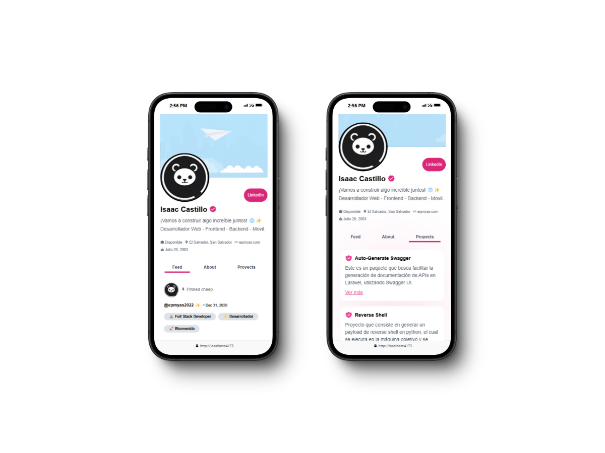

# Mi Portafolio Web 📁

Proyecto de portafolio web personal realizado con Vue 3 y Tailwind CSS que muestra información sobre mi perfil, proyectos, etc.

## Tecnologías utilizadas

- [Vue 3](https://vuejs.org/)
- [Tailwind CSS](https://tailwindcss.com/)
- [Node.js](https://nodejs.org/)
- [NPM](https://www.npmjs.com/)

## Requisitos 📋

- Node.js 20.0.0 o superior
- NPM 10.8.2 o superior

## Instalación 🔧

Primero clona el repositorio 📋

```bash
git clone
```

Instalamos las dependencias 📦

```bash
npm install
```

Instalar dependencias de producción

```bash
npm install --only=production
```

## Uso en modo desarrollo 🚀

```bash
npm run dev
```

## Construir para producción 🛠️

```bash
npm run build
```

## Preview 📷

### Desktop


### Mobile


